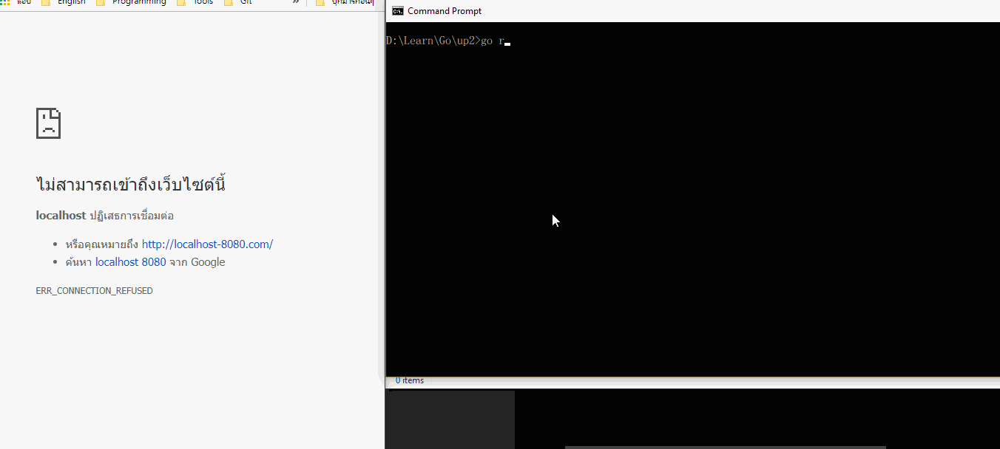

<p align="center">
</a>
</p>

# Golang Upload File
> การอัพโหลดไฟล์ จาก html form แล้วไปประมวลผลฝั่ง server โดยใช้ภาษา golang


### การติดตั้ง
#### 1. สั่ง run
```
  go run main.go
```

#### 2. เข้า url `localhost:8080`
